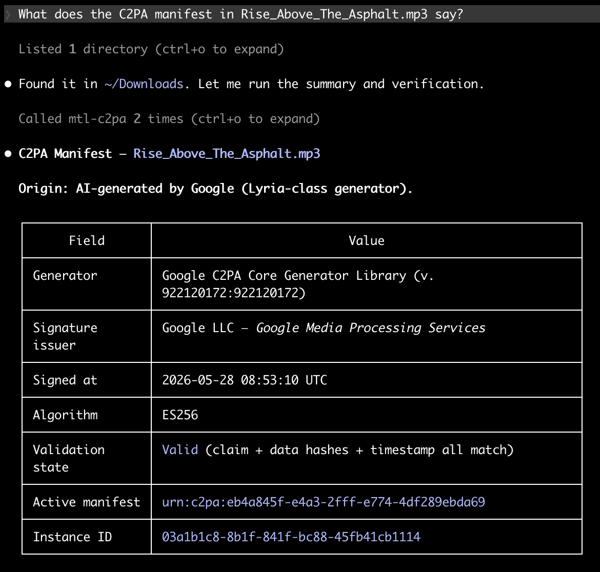
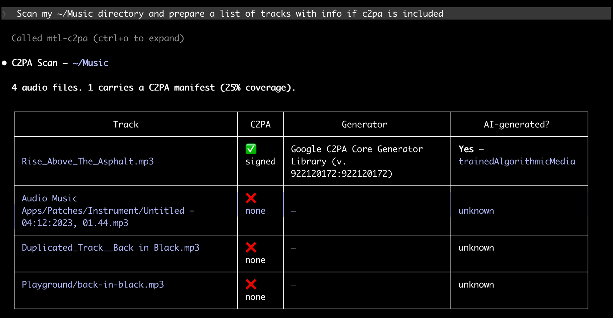

# mtl-c2pa-mcp

[](LICENSE)
[](https://github.com/musictechlab/mtl-c2pa-mcp/actions/workflows/ci.yml)
[](https://www.python.org/)
[](https://docs.astral.sh/ruff/)
[](https://modelcontextprotocol.io/)
[](https://musictechlab.io)

MCP server for reading [C2PA](https://c2pa.org/) content provenance manifests from media files — built for [Claude Code](https://claude.com/claude-code).

> **⚠️ Experimental** — Early development. The C2PA spec and tooling are still evolving. Don't rely on this for legal evidence or compliance work.

C2PA (Coalition for Content Provenance and Authenticity) is the open standard behind Adobe's Content Credentials and is now embedded in **Google Lyria** AI-generated MP3s. Each manifest records who created the file, what tool produced it, whether it's AI-generated, what watermarks (e.g. SynthID) were applied, and who signed the claim.

This MCP wraps the official [`c2pa-python`](https://github.com/contentauth/c2pa-python) library so Claude can read those manifests in plain language.



## Tools

| Tool | Description |
|------|-------------|
| `c2pa_summary` | Human-friendly summary: generator, AI flag, actions, ingredients, watermarks, signature |
| `c2pa_read` | Full raw manifest store as JSON |
| `c2pa_assertions` | List all assertions from the active manifest |
| `c2pa_ingredients` | List ingredients (sources used) from the active manifest |
| `c2pa_verify` | Signature issuer, validation state, successes & failures |
| `c2pa_scan` | Audit a directory: which files carry C2PA, which are AI-generated |
| `c2pa_info` | Library version and supported MIME types |

## Supported formats

The underlying `c2pa-python` library supports many formats. Most relevant here:

- **Audio**: MP3, WAV, FLAC, OGG, M4A, AAC
- **Image**: JPG, PNG, WebP, TIFF, AVIF, HEIC, GIF, SVG
- **Video**: MP4, MOV, AVI
- **Other**: PDF

Call `c2pa_info` for the full live list.

## Setup

```bash
git clone https://github.com/musictechlab/mtl-c2pa-mcp.git
cd mtl-c2pa-mcp
poetry install
```

## Claude Code configuration

```bash
claude mcp add -s user mtl-c2pa -- poetry --directory /path/to/mtl-c2pa-mcp run python -m mtl_c2pa_mcp
```

## Usage examples

Once configured, just ask Claude in natural language.

### Quick summary of a Lyria-generated MP3

> "What does the C2PA manifest in `~/Downloads/Sovereign_Ascent.mp3` say?"

```json
{
  "file": "/Users/you/Downloads/Sovereign_Ascent.mp3",
  "active_manifest": "urn:c2pa:80faaddf-fe27-1e7d-0ce5-4a70eeba2dd1",
  "generator": {
    "name": "Google C2PA Core Generator Library",
    "version": "916434528:916944653"
  },
  "is_ai_generated": true,
  "digital_source_types": [
    "http://cv.iptc.org/newscodes/digitalsourcetype/trainedAlgorithmicMedia"
  ],
  "actions": [
    {
      "action": "c2pa.created",
      "digitalSourceType": "http://cv.iptc.org/newscodes/digitalsourcetype/trainedAlgorithmicMedia",
      "description": "Created by Google Generative AI."
    },
    {
      "action": "c2pa.edited",
      "digitalSourceType": "http://cv.iptc.org/newscodes/digitalsourcetype/trainedAlgorithmicMedia",
      "description": "Applied imperceptible SynthID watermark."
    }
  ],
  "ingredients_count": 0,
  "watermarks": [
    {
      "label": "c2pa.actions.v2",
      "action": "c2pa.edited",
      "description": "Applied imperceptible SynthID watermark."
    }
  ],
  "signature_issuer": "Google LLC",
  "validation": "valid"
}
```

### Verify a signature

> "Is the C2PA signature on `track.mp3` valid? Who signed it?"

### Audit a music folder

> "Scan my `~/Music` directory and prepare a list of tracks with info if c2pa is included."



Or in raw JSON form:

```json
{
  "directory": "/Users/you/Downloads",
  "total_files": 12,
  "with_manifest": 3,
  "files": [
    {
      "file": "/Users/you/Downloads/Sovereign_Ascent.mp3",
      "has_manifest": true,
      "generator": {"name": "Google C2PA Core Generator Library", "version": "..."},
      "is_ai_generated": true,
      "digital_source_types": ["http://cv.iptc.org/newscodes/digitalsourcetype/trainedAlgorithmicMedia"]
    },
    {
      "file": "/Users/you/Downloads/photo.jpg",
      "has_manifest": false
    }
  ]
}
```

### Inspect raw manifest

> "Dump the full C2PA manifest store of `track.mp3`."

Returns the same JSON shape produced by `c2patool ./track.mp3` — useful when you need every field.

## Use inside Ableton Live

If you want to surface C2PA manifests on the selected clip in Ableton Live, the [`mtl-c2pa-ableton`](https://github.com/musictechlab/mtl-c2pa-ableton) repo ships a self-contained Max for Live device + local HTTP server. It bundles its own C2PA reader — no need to install this MCP separately.

## Why this exists

When Google shipped C2PA in Lyria MP3 downloads in May 2026, it became the first major DSP-adjacent player to embed AI provenance directly in music files. Inspecting those manifests usually means installing the Rust `c2patool` binary and reading raw JSON. This MCP lets you ask Claude *"is this AI-generated?"* and get a clean answer — same workflow as `mtl-metadata-mcp` and `mtl-vhc`, but for provenance instead of ID3 tags or human-cert registry lookups.

## Tech stack

- Python 3.10+
- [c2pa-python](https://github.com/contentauth/c2pa-python) — Adobe's official Rust-backed Python binding
- [MCP SDK](https://modelcontextprotocol.io/) (FastMCP)
- [Poetry](https://python-poetry.org/) — dependency management

## Contributing

See [CONTRIBUTING.md](CONTRIBUTING.md).

## Security

To report a vulnerability, see [SECURITY.md](SECURITY.md).

## License

MIT — see [LICENSE](LICENSE).

---

<div align="center">
  MusicTech Lab - Rockstars Developers dedicated to the Music Industry<br>
  <a href="https://musictechlab.io">Website</a>
  <span> | </span>
  <a href="https://linkedin.com/company/musictechlab">LinkedIn</a>
  <span> | </span>
  <a href="https://musictechlab.io/contact">Let's talk</a><br>
  Crafted by <a href="https://musictechlab.io">musictechlab.io</a>
</div>
